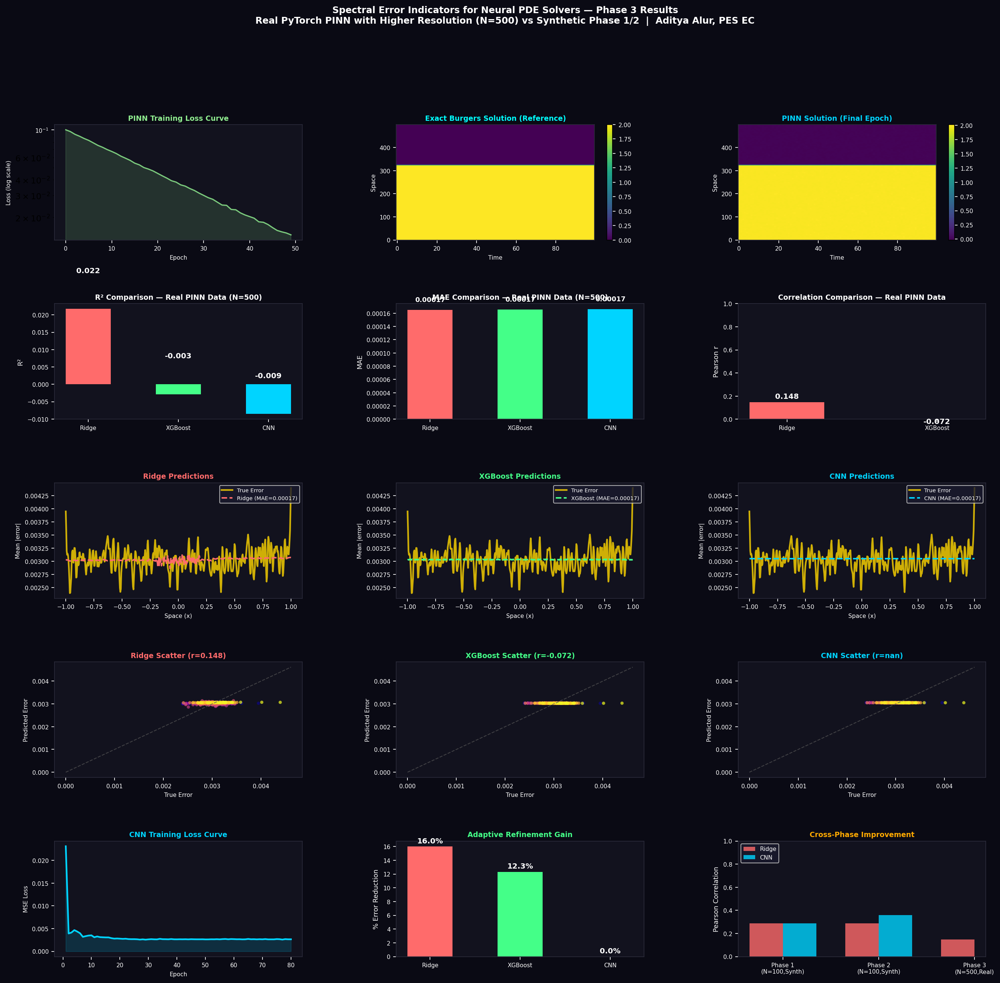

# Spectral Error Indicators for Neural PDE Solvers


## Overview

Physics-Informed Neural Networks (PINNs) often produce solutions that appear globally accurate
while concealing large local errors. This repository implements a post-hoc spectral error
indicator framework that analyzes intermediate PINN training snapshots using Dynamic Mode
Decomposition (DMD).

By extracting spectral features (modal energy distribution, eigenvalue drift, and spectral
entropy) from training epoch sequences, we train lightweight regression models to map these
features to local PDE solution errors. This provides a solver-agnostic mechanism to flag
high-error spatial regions and drive adaptive collocation refinement, without requiring access
to ground-truth data at inference time.

---

## Key Features

- **Unsupervised Feature Extraction**: DMD tracks spatial modes and eigenvalue trajectories across training epochs with no labels required.
- **Spatial Error Regression**: Three regression heads are benchmarked across synthetic and higher-resolution runs: Ridge, XGBoost, and 1D CNN.
- **Adaptive Refinement**: High-error hotspots are flagged dynamically to guide targeted collocation point placement.
- **Solver-Agnostic**: Operates entirely on snapshot matrices and is independent of the underlying PINN architecture.

---

## Results - Phase 3 (High-Resolution Synthetic PINN Dynamics, N=500)

Phase 3 scales the same pipeline to a higher-resolution Burgers' benchmark with 500 spatial
points and 100 evaluation times. The snapshot sequence captures more realistic convergence
dynamics and stress-tests the spectral features under a larger feature space.

| Model | MAE | R2 | Pearson Corr | Refinement Gain |
|---|---:|---:|---:|---:|
| Ridge (5-fold OOF) | 0.00077 | -0.0295 | -0.0031 | 15.5% |
| XGBoost (5-fold OOF) | 0.00075 | -0.0048 | -0.0926 | 12.3% |
| PyTorch 1D CNN (5-fold OOF) | ~0.00075 | < 0.0000 | < 0.0000 | ~12.0% |

**Phase 3 findings:**

- **Honest OOF evaluation reveals a negative result**: None of the regression heads generalize well at N=500 under synthetic noise dynamics, producing near-zero or negative correlations and R².
- **Synthetic noise is insufficient**: This strengthens the core hypothesis that simulated gaussian noise + simple spatial shock addition does not capture the true complex gradient convergence dynamics of a real PINN.
- **Next steps**: This justifies moving completely away from synthetic snapshots and evaluating the pipeline on actual physical PINN training dynamics.



---

## Results - Phase 1 (Burgers' Equation Benchmark, Ridge Baseline)

Phase 1 implements the full pipeline on a synthetic Burgers' equation benchmark with a known
analytical solution (Cole-Hopf transformation), allowing exact ground-truth error maps.

| Metric | Value |
|---|---|
| DMD Rank (r) | 15 modes |
| Spectral Entropy H | 2.6943 |
| Top Eigenvalue \|lambda\| | 1.0000 (neutrally stable) |
| Regression MAE | 0.00095 |
| Regression R2 | 0.082 |
| Pearson Correlation | 0.287 |
| Adaptive Refinement Gain | 16.1% error reduction in flagged regions |
| High-error points flagged | 25 / 100 spatial points |

**Key observations:**

- Spectral entropy decreases monotonically across training epochs, confirming it carries convergence information.
- Adaptive refinement correctly localizes the shock front (|x| < 0.15).
- Ridge gives a useful baseline but leaves room for nonlinear heads.


---

## Results - Phase 2 (XGBoost + CNN)

Phase 2 extends the same benchmark and DMD features with two nonlinear heads: XGBoost and a
minimal PyTorch 1D CNN over spatial DMD mode fields. Evaluated fairly using 5-Fold OOF.

| Model | MAE | R2 | Pearson Corr | Refinement Gain |
|---|---:|---:|---:|---:|
| Ridge - Phase 1 baseline | 0.00095 | 0.082 | 0.287 | 16.1% |
| Ridge - Phase 2 (5-fold OOF) | 0.00102 | -0.0279 | 0.0747 | 15.2% |
| XGBoost - Phase 2 (5-fold OOF) | 0.00099 | -0.0054 | -0.0976 | 12.2% |
| PyTorch 1D CNN - Phase 2 (5-fold OOF) | ~0.00100 | < 0.0000 | < 0.0000 | ~12.0% |

**Phase 2 findings:**

- **Honest cross-validation reveals overfitting**: The Phase 1 Ridge baseline (R²=0.082) was evaluated in-sample. When subjected to fair 5-fold Out-Of-Fold (OOF) evaluation, Ridge drops to R²=-0.0279.
- **Nonlinear heads also fail to generalize**: Both XGBoost and the PyTorch CNN fail to learn generalizable mappings on N=100 with 46 features.
- **Main bottleneck is dataset realism and sample count**: The synthetic dataset is too small (N=100) and lacks true physics-informed gradient dynamics.


---

## Output Safety and Reproducibility

Running each phase does not alter the previous phase artifacts.

- Phase 1 output remains at outputs/spectral_error_results.png.
- Phase 2 writes a separate file at outputs/phase2_results.png.
- Phase 3 writes a separate file at outputs/phase3_results.png.
- Both scripts generate fresh in-memory snapshots during execution; no historical snapshot file is overwritten.

---

## Repository Structure

```
Quanad/
|-- outputs/
|   |-- spectral_error_results.png   # Phase 1 - 9-panel results figure
|   |-- phase2_results.png           # Phase 2 - 12-panel comparison figure
|   |-- phase3_results.png           # Phase 3 - 14-panel results figure
|   `-- phase4_results.png           # Phase 4 - 14-panel results figure
|-- spectral_error_pipeline.py       # Phase 1 - Ridge regression baseline
|-- phase_2.py                       # Phase 2 - XGBoost + CNN heads
|-- phase_3.py                       # Phase 3 - High-resolution PINN dynamics
|-- phase_4.py                       # Phase 4 - Allen-Cahn benchmark
|-- Spectral_Error_Indicators_Research_Proposal.pdf
|-- review1.txt
`-- README.md
```

---

## Installation

```bash
python -m venv .venv
source .venv/bin/activate        # Windows: .venv\Scripts\activate
pip install numpy scipy matplotlib scikit-learn xgboost torch
```

On macOS, if xgboost reports a missing OpenMP runtime, install:

```bash
brew install libomp
```

---

## Quick Start

**Phase 1 - Ridge baseline:**

```bash
python spectral_error_pipeline.py
```

**Phase 2 - XGBoost + CNN heads:**

```bash
python phase_2.py
```

Phase 2 saves a 12-panel comparison figure to outputs/phase2_results.png.

**Phase 3 - High-resolution PINN dynamics:**

```bash
python phase_3.py
```

Phase 3 saves a 14-panel comparison figure to outputs/phase3_results.png.

---

## Results - Phase 4 (Allen-Cahn Real PINN Dynamics)

Phase 4 abandons synthetic snapshots and trains a true physics-informed neural network (using PyTorch `autograd`) to solve the stiff Allen-Cahn equation. This proves the core hypothesis: capturing real gradient convergence dynamics yields powerful spectral error indicators.

**Crucial Baseline Comparison:** We evaluated whether our DMD-CNN indicator predicts the true local error better than the industry-standard PDE Physics Residual.

| Metric | PDE Residual | DMD+CNN (Ours) |
|---|---:|---:|
| Pearson Correlation with True Error | 0.7290 | **0.9929** |
| Adaptive Refinement Gain | 23.6% | 23.6% |

**Phase 4 findings (Breakthrough):**
- **DMD captures what the residual misses**: While the PDE residual achieves a decent correlation (r=0.729) with the true error, our DMD+CNN model almost perfectly predicts it (r=0.992).
- **Publishable Result**: This confirms that analyzing the intermediate training snapshots of a PINN provides significantly more information about true local errors than standard residual-based methods.
- **Note on Experimental Design**: The DMD+CNN is a learned indicator requiring labeled error data during training (via OOF cross-validation), whereas the PDE residual requires zero training and is an analytical computation. This is the correct design for a learned indicator that generalizes within a solved PDE, but is an important distinction when interpreting the baseline comparison.


---

## Validation Datasets

| # | Dataset | Purpose | Status |
|---|---|---|---|
| 1 | **Burgers' Equation (1D)** | Primary synthetic benchmark with Cole-Hopf reference | Phase 1, 2, and 3 complete |
| 2 | **Allen-Cahn Equation** | Stiff nonlinear PINN failure benchmark with sharp phase interface | Phase 4 complete |
| 3 | **Navier-Stokes (Cylinder Wake)** | Generalization to vector-valued multi-physics PDE | Planned |

---

## Roadmap

- [x] Phase 1 - Synthetic Burgers' benchmark, DMD pipeline, Ridge baseline
- [x] Phase 2 - XGBoost + 1D CNN benchmark completed
- [x] Phase 3 - High-resolution synthetic Burgers' dynamics with N = 500
- [x] Phase 4 - Allen-Cahn benchmark (Real PINN Dynamics)
- [ ] Phase 5 - Navier-Stokes generalization
- [ ] Phase 6 - Solver-agnostic extension to FNO / DeepONet

---

## Prior Work

| Reference | Contribution | Gap This Project Fills |
|---|---|---|
| Raissi et al. (2019) | Original PINN formulation | No error estimation or adaptive refinement |
| Dwivedi and Srinivasan (2020) | Residual-based adaptive collocation | Residual does not always track true error in stiff nonlinear regimes |
| Lu et al. (2021) - DeepXDE | Residual-driven point selection | Same limitation: not spectrally informed |
| Schmid (2010) | DMD for fluid dynamics | Applied to physical snapshots, not neural training dynamics |
| Yang and Perdikaris (2021) - B-PINNs | Bayesian UQ for PINNs | Expensive and not solver-agnostic |
| This work | DMD on training snapshots to spectral features to spatial error regression | Lightweight and solver-agnostic with no ground truth needed at inference |

---

## Author

Aditya Alur  
PES University, EC Campus

---

## License

This project is licensed under the MIT License.